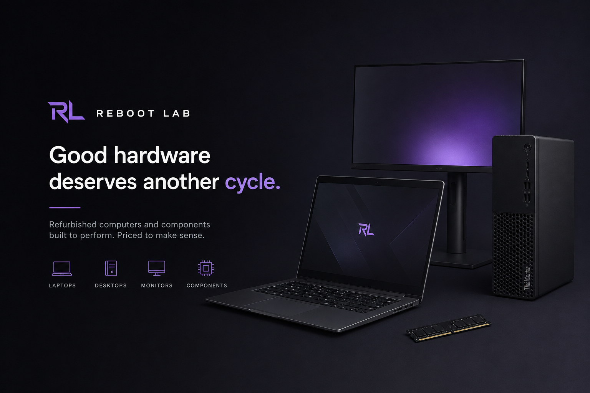

# Reboot Lab



A modern refurbished technology storefront built with Astro and Tailwind CSS, created as a learning lab for exploring decoupled CMS architecture, Git-based content workflows and modern deployment practices.

Reboot Lab is a fictional shop focused on giving computers, components and electronics a second life.

## Project goals

This project is not only about building a storefront UI. It is also an architecture lab designed to explore how a modern static-first frontend can work with Git-managed content and progressively evolve toward a production-ready deployment workflow.

The project is being built incrementally, with a strong focus on understanding each architectural decision rather than adding the entire stack at once.

## Tech stack

Current:

- Astro
- TypeScript
- Tailwind CSS
- Astro Assets
- Git / GitHub

Planned:

- Astro Content Collections
- Decap CMS
- React Islands where client-side interactivity is actually needed
- Docker
- Docker Compose
- CI/CD
- Reverse proxy
- VPS deployment
- GitOps-oriented workflows

## Current features

- Shared Astro layout
- Responsive site header
- Editorial technology-focused hero section
- Product categories
- Dynamic category routes
- Product filtering by category
- Reusable product cards
- Responsive footer
- Optimized local images with Astro Assets

## Project structure

```text
src/
├── assets/
│   ├── images/
│   └── index.ts
├── components/
├── data/
│   ├── categories.ts
│   └── products.ts
├── layouts/
├── pages/
│   └── categories/
│       └── [slug].astro
├── styles/
│   └── global.css
└── types/
    ├── category.ts
    └── product.ts
